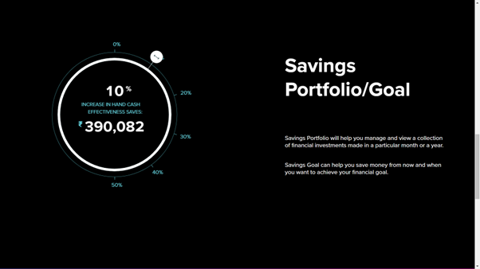
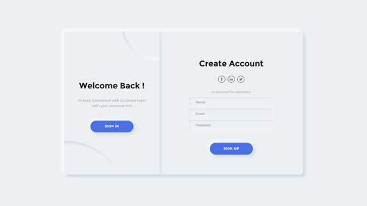

# Financeiio-Finance-Assistant-using-Django
Finance Assistant System using Django and XAMPP server, featuring a dynamic Three.js UI. The system offers secure user login, comprehensive portfolio management, real-time cryptocurrency price tracking, up-to-date financial news, and information on government financial aid schemes.

## Features
- **User Authentication**
  - Secure registration and login
  - Password hashing and protection

- **Portfolio Management**
  - Track and manage investments
  - View performance metrics

- **Live Cryptocurrency Prices**
  - Real-time updates on various cryptocurrencies
  - Interactive charts and graphs

- **Financial News**
  - Latest updates from the financial world
  - Categorized news for easy navigation

- **Government Financial Aid Schemes**
  - Information on available government schemes
  - Eligibility criteria and application processes

- **Interactive UI**
  - Dynamic 3D visualizations using Three.js
  - Responsive and user-friendly design

## Screenshots

